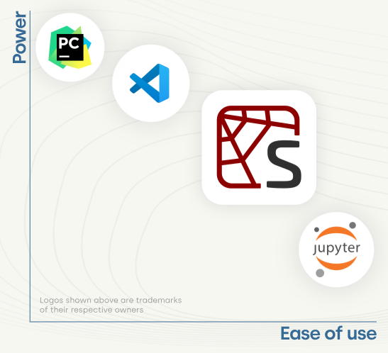

# Python Editors  

Most R and Matlab user are used to editors or IDEs (Integrated Development Environments) like [RStudio](https://posit.co/download/rstudio-desktop/) or [Matlab](https://nl.mathworks.com/products/matlab.html?requestedDomain=) or [Octave](https://octave.org/).

## Code Highlighting Text Editors

Traditionally Python code is written in text editors, ideally with code highlighting like:

- [Vim](https://www.vim.org/)
- [Sublime](https://www.sublimetext.com/)
- [Emacs](https://www.gnu.org/software/emacs/)
- [NeoVim](https://neovim.io/)
- many more exist out there...  
  
## IDEs

 IDEs have started to establish themselves a bit, most notably Jupyter Notebooks, Spyder, VS Code and PyCharm.  
 At least according to the Spyder webpage, these IDEs rank as follows in terms of ease of use and power or flexibility:  
 

### [Spyder](https://www.spyder-ide.org/)  

  
Spyder is likley the closest you can get to `RStudio` or `Matlab` when using Python.  
Spyder is part of [Anaconda](https://anaconda.org/anaconda/spyder), to install follow the [guide here](https://docs.spyder-ide.org/current/installation.html) (you can use a standalone install or use ```mamba install -c conda-forge spyder```) or [try it online](https://mybinder.org/v2/gh/spyder-ide/binder-environments/spyder-stable?urlpath=git-pull%3Frepo%3Dhttps%253A%252F%252Fgithub.com%252Fspyder-ide%252FSpyder-Workshop%26urlpath%3Ddesktop%252F%26branch%3Dmaster).  

### [VS Code](https://code.visualstudio.com/docs/languages/python)

  
VS Code needs a bit of a setup at first. Luckily there are [good tutorials on how to set it up](https://code.visualstudio.com/docs/languages/python). Once it is configured appropriately, it is very easy to use and includes handy features like real time previews of markdown and [notebook files](https://code.visualstudio.com/docs/datascience/jupyter-notebooks), integration of Github [Copilot](https://code.visualstudio.com/docs/copilot/overview), ability to use [virtually any language](https://code.visualstudio.com/docs/languages/overview).

### [PyCharm](https://www.jetbrains.com/pycharm/)  


[PyCharm](https://www.jetbrains.com/pycharm/) is a very powerful editor, with a bit of a learning curve when it comes to getting used to it. But having said this, it has a lot of built-in tools that can make programming and organising code efficient, especially when working on large projects.  

## Notebooks  

Notebooks are a popular too for sharing documentations, reports or transparent sceintific data analysis, combining, text, equations, code, plots and results.  
See the next chapter for details on Jupyter and Jupyter notebooks.
