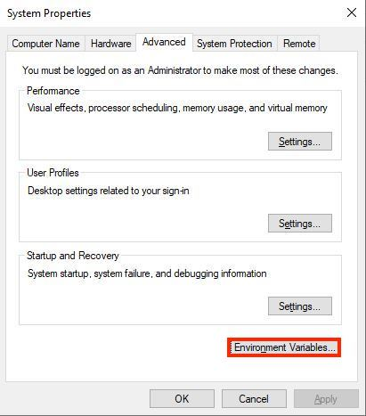
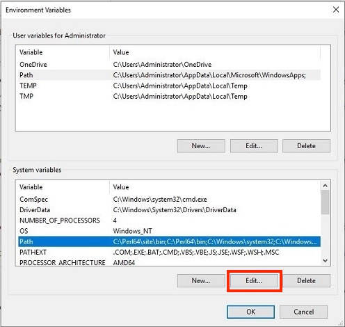

---
jupytext:
  formats: md:myst
  text_representation:
    extension: .md
    format_name: myst
    format_version: 0.13
    jupytext_version: 1.11.5
kernelspec:
  display_name: Python 3
  language: python
  name: python3
---

# Minimal install conda, mamba, Python  

The very easiest way to get a minimal install of [Conda](https://conda.io/), [Mamba](https://github.com/mamba-org/mamba) and Python, with conda-forge as default channel is to install [Miniforge](https://github.com/conda-forge/miniforge).  
Once Miniforge is installed, you should be able to use ```conda``` and ```mamba``` in your terminal.  

The very easiest way to install Miniforge is to download and run a provided installer for your OS  from [https://conda-forge.org/download/](https://conda-forge.org/download/)  

**Mac & Linux**: Download the installer and run ```bash Miniforge3-$(uname)-$(uname -m).sh```
**Windows**: download and run the Windows installer.  

**Note for Windows users:**  
By default the commands are not added to the path environment (making them available in the default Windows Command Prompt (CMD)). This is a precautious step, to avoid chances of software conflicts.  
*Solutions:*  

* Option 1 (easiest, safest): Use *Anaconda Prompt*, like the freshly installed *Miniforge Prompt*
* Option 2: Initialise conda in the *Anaconda Prompt* by typing ```conda init```. Close your propmpt window and open it again. Now the commands should be available
* Option 3: [Manually add](https://learn.microsoft.com/en-us/previous-versions/office/developer/sharepoint-2010/ee537574(v=office.14)#to-add-a-path-to-the-path-environment-variable) ```C:\Users\myusername\miniforge3\condabin``` to the path environment. This will allow you to use the commands from any prompt, with limited risk of conflicts with other software.  

## Alternative - Using (mini)conda

### Installing *miniconda*

### Mac  

On a mac, run the following four commands in a terminal window (create a new miniconda3 directory in your home directory, dowload the latest version of Miniconda, silently run the installer, remove the installer).

If you have a new Apple Silicon chip  

```bash
mkdir -p ~/miniconda3

curl https://repo.anaconda.com/miniconda/Miniconda3-latest-MacOSX-arm64.sh -o ~/miniconda3/miniconda.sh

bash ~/miniconda3/miniconda.sh -b -u -p ~/miniconda3

rm ~/miniconda3/miniconda.sh
```

### Linux

1. Download and rename the latest verison of Miniconda:  
   `wget https://repo.anaconda.com/miniconda/Miniconda3-latest-Linux-x86_64.sh -O ~/miniconda3/miniconda.sh`
2. Silently install miniconda:   
  `bash ~/miniconda3/miniconda.sh -b -u -p ~/miniconda3`  
3. Remove the installer:  
  `rm ~/miniconda3/miniconda.sh`  
4. Close and reopen the terminal or run:  
  `source ~/miniconda3/bin/activate`   
5. To initialise *conda* on  on all shells use:  
  `conda init --all`  

### Windows  
#### Install using Installer
Download the installer from the [anaconda website](https://repo.anaconda.com/miniconda/Miniconda3-latest-Windows-x86_64.exe)  
Install for current user, without automatically setting the Windows env 
  
After the Miniconda setup finishes, we can't call *conda* from the command line until we have added it to our system environment.  

##### Setting Path Environment
1. Open the Start Menu and search for 'Environment Variables'. You will likely have to enter your admin credentials.
2. Click on 'Edit the system environment variables'.
3. In the System Properties window, click on 'Environment Variables'  
  
4. In the Environment Variables window, under 'System variables', find and select 'Path', then click on 'Edit'.
  

5. Add 'New' and select folder where Miniconda was installed:  
For conda, pip, etc.: `C:\Users\<YOURUSERNAME>\AppData\Local\miniconda3\Scripts`  
For Python: `C:\Users\<YOURUSERNAME>\AppData\Local\miniconda3\`  

Press OK in all open Windows.  

This should have made `Python` and `conda` accessible from the Anaconda Prompt. To test this, open a new Anaconda Prompt window:  
Start Menu -> Anaconda (miniconda3) -> Anaconda Prompt.  
  

### Check miniconda and Python install

Open *Anaconda prompt* (or any terminal on Linux and Mac).  

Check the verison of conda: `conda info`   
Check which Python version is installed: `python -V`    
